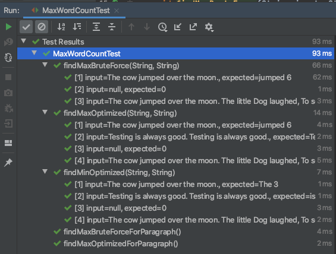

# Word Count Project

## How to run the code

  Step 1: Git clone the project 
  
  Step 2: Run `mvn clean install` This will run the tests.
  
  Step 3: Run `mvn surefire-report:report` This will share a handy report with the runtime. [Click Here to View a Static report](./site/surefire-report.html)
  

## Code 
Write a method or function in the major programming language of your choice that returns the longest word in a sentence and its length. For example, “The cow jumped over the moon.” should return “jumped” and 6.

### Assumptions
 1. Special characters needs to be removed before processing.
 2. Return type in java can return one type from the method I will use a string with space. So the result will be "jumped 6".
 3. On Duplicates - Assuming first largest and first minimum string. Code can be modified to handle both.
 4. Total length of words assuming it to be iterable. 

### Methods
  There are 2 methods that I implemented [Click Here to view Code](./src/main/java/com/interview/project/wordcount/MaxWordCount.java)
   1. findMaxBruteForce() : Brute force way to find the word with max length. 
   2. findMaxOrMinOptimizedUsingHeap() : Using Heap I implemented both Min and Max Word length. I initially wrote code for Max and then reused it with couple of method param for Min word search
   
### Iterations
There are 2 ways of Iteration I have used. 
1. Convert String to String[] by splitting the string by space. 
              
    ```
    // Split the string into String array
    String[] dataArray = data.split(" ");
    
    // Loop the array to get the max word and its count.
    for (int i = 0; i < dataArray.length; i++) {
       String current = dataArray[i];
    
    // Remove Non Alphanumeric Character from the string
    current = current.replaceAll("[^a-zA-Z0-9]", "");
    
    // If current is bigger than maxWord replace it.
    if (current.length() > maxLength) {
       maxLength = current.length();
       maxWord = current;
    }
    ```
   
 2. Check character by character and substring when I find space. This was to avoid another set of space for String array and then Heap.
 
    ```
    int start = 0;
    
    // Iterate over the string and find the space and then add the word to the heap.
    for (int i = 0; i < data.length(); i++) {
        if (data.charAt(i) == ' ') {
            String current = data.substring(start, i);
            word.add(current.replaceAll("[^a-zA-Z0-9]", ""));
            start = i + 1;
        }
    }
    ```
## Test
   I have used JUnit 5 and leveraged Parameterized test inputs. I have 13 test cases. 
   
   Methods for these 13 test cases are only 5 [Click here to view the tests](./src/test/java/com/interview/project/wordcount/MaxWordCountTest.java)
   
   


